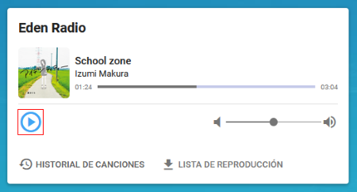
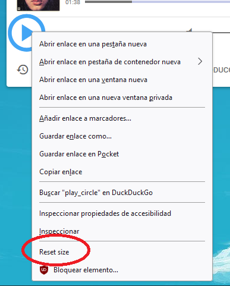

# Zoom Single Item
A Firefox extension to permanently resize a single element in a website (including all pages in the same domain).

Press Ctrl+Alt and the element under the cursor will be highlighted. Then, scroll up or down to resize it.

This could be useful for accessibility, or simply for when a very repetitive task is cumbersome due to constantly having to click very small items on a website.

The custom size will be stored in your browser's local memory.

To restore the original size, use the context menu:

## To do
- Neighbour elements should be displaced?
- Resized element is identified by a CSS selector. All elements with the same CSS selector get resized. Consider adding an "N-th" attribute to the selector so that only one is resized. Note that this might not be what the user intends, so it should be optional.
- Many elements in websites don't resize correctly. Find out why. Probably caused by a CSS conflict.